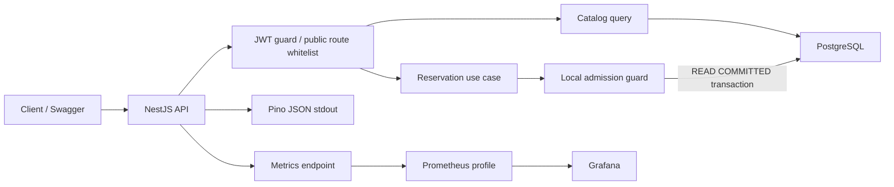
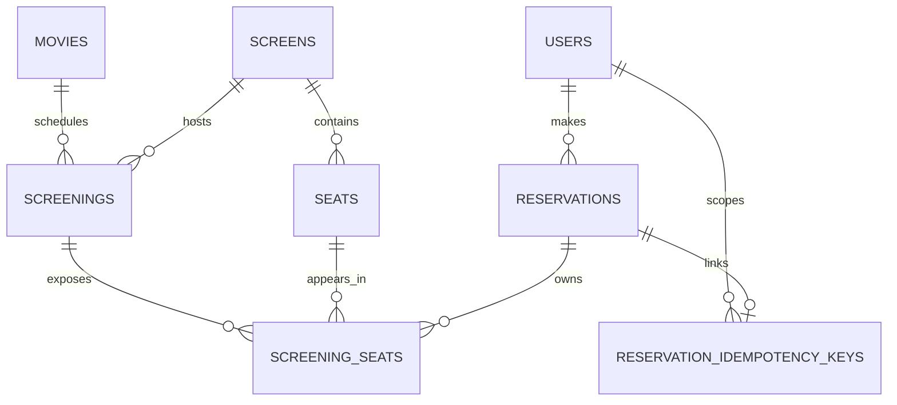
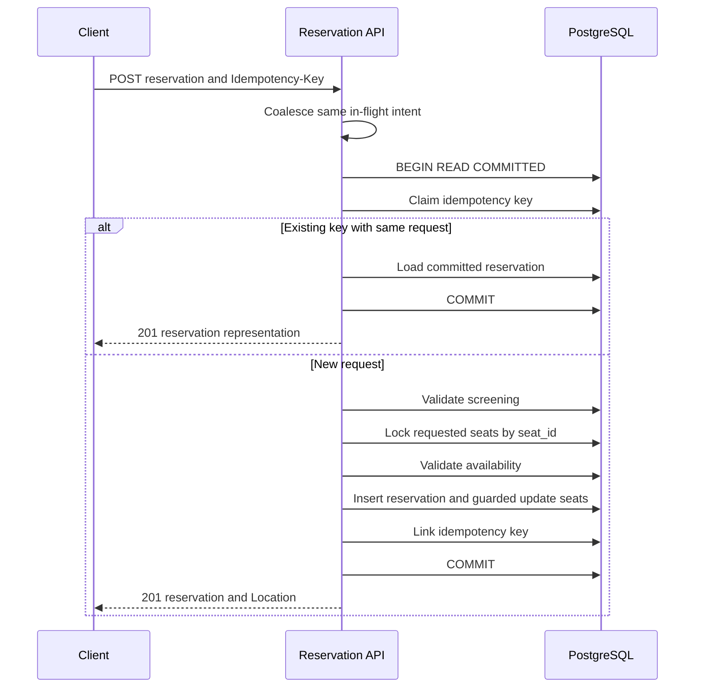

# Movie Ticket Reservation System

## 영화 좌석 예매 시스템

본 프로젝트는 인기 상영의 예매가 열리는 순간처럼 같은 좌석에 요청이 겹치는 상황을 가정하고, 좌석이 두 사람에게 팔리지 않도록 정합성을 보장하는 Node.js 24 + NestJS + PostgreSQL 18 기반 백엔드 시스템입니다.

이 문제를 단순히 좌석 상태를 `UPDATE`하는 CRUD로 보지 않았습니다. 두 사람이 같은 순간에 같은 좌석을 요청하면 "비어 있는지 확인"과 "잡는다" 사이에 틈이 생기고, 그 틈은 요청이 몰릴수록 넓어집니다. 그래서 이번 구현에서는 "확인과 배정 사이에 다른 transaction이 끼어들 수 없게 하려면 무엇을 잠가야 하는지", "응답을 받지 못한 사용자가 다시 눌렀을 때 무엇으로 같은 요청임을 알아볼 것인지", "각 단계에서 서버가 죽으면 무엇이 남는지"를 중심으로 설계했습니다.

> 좌석은 잠근 뒤에 판정합니다. 같은 의도의 재요청은 같은 결과를 돌려줍니다. transaction 밖의 대기와 재시도는 DB를 보호하되, 소유권 판정을 대신하지 않습니다.

## 핵심 결정

| 문제                  | 선택                                                       | 이유                                                      |
| --------------------- | ---------------------------------------------------------- | --------------------------------------------------------- |
| 같은 좌석의 동시 예매 | PostgreSQL transaction, 정렬 row lock, guarded update      | 소유권을 한 DB에서 한 번만 판정합니다.                    |
| 응답 유실 뒤 재요청   | `Idempotency-Key`와 request hash를 같은 transaction에 기록 | 같은 의도는 기존 예약을 돌려주고, 다른 의도는 거절합니다. |
| 요청 급증             | 같은 요청 합치기, 짧은 process 대기열, `429`/`503`         | 한 API instance가 DB pool을 과점유하지 않게 합니다.       |
| AI 활용의 재현성      | 저장소 지침, task skill, 실행 검증                         | 도구가 달라도 같은 불변식과 검증 순서를 따르게 합니다.    |


## API 범위

| 기능             | 경로                                                             |
| ---------------- | ---------------------------------------------------------------- |
| 회원가입, 로그인 | `POST /api/v1/auth/signup`, `POST /api/v1/auth/login`            |
| 영화, 상영 조회  | `GET /api/v1/movies`, `GET /api/v1/movies/:movieId/screenings`   |
| 좌석 지도        | `GET /api/v1/screenings/:screeningId/seats`                      |
| 좌석 예매        | `POST /api/v1/screenings/:screeningId/reservations`              |
| 예매 목록, 상세  | `GET /api/v1/reservations`, `GET /api/v1/reservations/:publicId` |

모든 business API는 `/api/v1` 아래에 두고, 성공은 `{ success: true, data }`, 실패는 `{ success: false, error, traceId }`로 반환합니다. 가입과 새 예매는 representation을 반환하므로 `201`, stateless login과 조회는 `200`을 사용합니다.

이 시스템은 결제 없는 즉시 확정 예매만 구현했습니다. 결제, 좌석 임시 점유, 취소, 관리자 CRUD는 범위에서 제외했습니다. 결제가 없는 흐름에 hold만 더하면 만료, 좌석 복구, 결제 실패 보상, 환불까지 하나의 상태 전이가 열리므로, 이 구현에서는 짧은 확정 transaction의 정합성을 먼저 분명하게 만들었습니다.

## 설계 방향과 범위

예매 write path를 작은 modular monolith로 구성했습니다. 이 구현에서 중요한 경계는 여러 서비스가 메시지를 주고받는 구조가 아니라, 하나의 좌석 소유권을 짧고 검증 가능한 transaction 안에서 확정하는 일입니다. 그래서 service 간 network 호출과 distributed transaction은 추가하지 않았습니다.

<details>
<summary>선택지와 비용을 함께 본 기준</summary>

| 결정 지점   | 비교한 선택지                                          | 현재 선택                   | 선택 이유와 감수한 비용                                                                                                                                         |
| ----------- | ------------------------------------------------------ | --------------------------- | --------------------------------------------------------------------------------------------------------------------------------------------------------------- |
| 서비스 구조 | 분리된 서비스, modular monolith                        | modular monolith            | 예매 write path의 transaction 경계를 한 곳에서 보존합니다. service 간 network 경계는 현재 구현에 추가하지 않았습니다.                                           |
| 좌석 소유권 | PostgreSQL transaction, Redis lock, Kafka/queue        | PostgreSQL transaction      | 최종 소유자를 정하는 row lock, conditional write, FK를 한 데이터베이스에서 묶습니다. Redis나 queue를 더해도 마지막 DB 판정은 남습니다.                          |
| SQL 표현    | ORM 중심, 핵심 query만 직접 SQL                        | NestJS와 직접 SQL           | controller/guard/filter/module은 NestJS를 쓰되, lock 순서와 guarded update는 query 자체가 설계 설명이 되도록 남겼습니다. ORM의 CRUD 생산성 일부는 포기했습니다. |
| 공개 식별자 | bigint 노출, application UUID, DB UUIDv7               | internal bigint + DB UUIDv7 | join과 FK는 작은 내부 key를 쓰고 외부 URL에는 추측하기 어려운 public id를 사용합니다. PostgreSQL 18 의존성은 생깁니다.                                          |
| 인증        | server session, access + refresh token, access token만 | 짧은 JWT access token       | refresh token의 저장·폐기·탈취 대응은 구현하지 않았습니다. 이 범위에서는 stateless access token만 발급합니다.                                                   |
| 좌석 상태   | 즉시 확정, TTL hold                                    | 즉시 확정                   | 결제가 없으므로 hold 만료와 복구 worker보다 짧은 확정 transaction이 더 예측 가능합니다.                                                                         |
| 조회 cache  | Redis/process cache, HTTP cache, no-store              | 영화 목록만 HTTP cache      | 영화 목록은 약간 늦어도 안전하지만 좌석 지도는 최신성이 중요합니다. cache invalidation 상태를 추가하지 않았습니다.                                              |
| 테스트      | mock 중심, 실제 PostgreSQL e2e                         | 둘 다 사용                  | 빠른 unit test와 실제 lock/FK/transaction e2e를 나눴습니다. e2e는 Docker 실행 시간이 듭니다.                                                                    |

PostgreSQL을 고른 핵심 이유는 UUID 함수가 아니라 row-level lock, transaction, conditional write, FK 제약을 한 곳에서 사용하기 위해서입니다. Compose image는 `postgres:18.6-bookworm`으로 고정했고, 로컬 실행, e2e, migration이 같은 동작을 보게 했습니다. DB 기본값의 `uuidv7()`으로 extension 없이 시간 순서에 가까운 public id를 만들었습니다. 이 레포는 PostgreSQL 18을 실행 기준으로 삼으며, 좌석 정합성 자체는 row lock과 FK를 지원하는 더 이른 PostgreSQL에서도 같은 방식으로 성립합니다.

</details>

## 시스템 구조



한 process와 한 PostgreSQL에서 시작하는 modular monolith입니다. 지금은 예매 write path가 가장 중요한 transaction 경계이므로, 서비스를 나누어 네트워크 실패와 분산 transaction을 늘리지 않았습니다.

```text
src/
  common/           config, response envelope, error filter, request context
  infrastructure/   PostgreSQL pool and transaction manager
  modules/
    auth/           password hashing, JWT, user repository
    catalog/        read-only movie, screening, seat queries
    reservation/    presentation, application, domain, ports, PostgreSQL adapters
tests/              unit tests and PostgreSQL-backed e2e tests
load-test/          k6 concurrency scenario
```

Reservation의 application/domain/ports는 PostgreSQL과 NestJS 구현을 직접 import하지 않습니다. 반대로 lock 순서와 guarded update는 이 문제의 핵심이라 직접 SQL로 드러냈습니다. 읽기 전용 catalog에는 같은 계층을 과하게 복제하지 않았습니다.

### ERD



`screening_seats`는 상영의 특정 좌석입니다. 같은 물리 좌석도 상영마다 별도 row를 가지며, `reservation_id IS NULL`만이 빈 좌석 상태입니다. 별도 `AVAILABLE`/`RESERVED` 문자열 상태를 두지 않아 상태 값과 FK 참조가 어긋나는 경로를 만들지 않았습니다.

<details>
<summary>DB가 지키는 규칙과 index 보기</summary>

| 불변식                                        | DB에서 지키는 방식               | 필요한 이유                                             |
| --------------------------------------------- | -------------------------------- | ------------------------------------------------------- |
| login email은 대소문자와 무관하게 유일        | `uq_users_email_lower`           | 가입 중복 검사와 login lookup이 같은 규칙을 씁니다.     |
| 좌석은 자신이 속한 상영관의 상영에만 연결     | screening/seat 복합 FK           | 다른 상영관 좌석을 요청에 섞는 데이터를 막습니다.       |
| 좌석 예약과 reservation의 상영이 같다         | reservation/screening 복합 FK    | 잘못된 SQL이 다른 상영의 예약을 연결하지 못하게 합니다. |
| idempotency key와 reservation의 사용자가 같다 | reservation/user 복합 FK         | 다른 사용자의 예약 결과를 key로 참조하지 못하게 합니다. |
| 한 screening-seat의 소유자는 한 명뿐          | `screening_seats.reservation_id` | 중복 예매를 표현할 별도 상태를 만들지 않습니다.         |
| 여러 좌석은 전부 확정되거나 전부 rollback     | 하나의 transaction               | 부분 성공 예매를 남기지 않습니다.                       |

| index 또는 key                                 | 사용하는 흐름                      | 넣지 않은 대안과 이유                                            |
| ---------------------------------------------- | ---------------------------------- | ---------------------------------------------------------------- |
| `uq_users_email_lower`                         | 가입 중복 검사, login email lookup | 원본 email index만 두면 `lower(email)` 조건의 규칙과 어긋납니다. |
| `idx_screenings_movie_time`                    | 영화별 미래 상영 시간순 조회       | `starts_at` 단독 index보다 movie 조건을 먼저 좁힙니다.           |
| `screening_seats` PK `(screening_id, seat_id)` | 정렬 lock, guarded update          | 별도 seat lock index는 PK와 중복됩니다.                          |
| `idx_ss_reservation` partial index             | reservation detail의 좌석 join     | 예약된 row만 담아 완료 reservation 조회를 돕습니다.              |
| `idx_reservations_user_recent`                 | user별 최신순 cursor pagination    | user filter, 정렬, cursor 조건을 함께 처리합니다.                |
| idempotency PK `(user_id, idempotency_key)`    | key claim, replay, link            | key를 사용자 범위로 분리하고 DB가 중복을 막습니다.               |

좌석 지도는 특정 상영의 모든 좌석을 정렬해 보여 주므로, 빈 좌석만 위한 partial index는 추가하지 않았습니다. 이 index set은 현재 query 모양에 맞춘 것이며, 예매마다 갱신되는 index를 관성적으로 늘리지 않았습니다.

</details>

## 좌석 예매 정합성



1. `seatIds`를 중복 없이 정렬하고, 이 값을 request hash와 lock 순서에 함께 사용합니다.
2. idempotency key를 claim합니다. 같은 key와 다른 body면 `422 IDEMPOTENCY_KEY_REUSED`입니다.
3. 새 key면 상영 시작 여부를 확인하고, 요청 좌석을 `seat_id ASC`로 `SELECT ... FOR UPDATE` 합니다.
4. 잠근 뒤에 좌석 존재와 예약 여부를 판단합니다. lock query에서 빈 좌석만 미리 거르지 않아 `SEAT_NOT_IN_SCREENING`과 `SEAT_ALREADY_RESERVED`를 구분합니다.
5. reservation을 insert하고 `reservation_id IS NULL` 조건의 guarded update로 좌석을 배정합니다. 영향 row 수가 요청 수와 다르면 invariant violation으로 rollback합니다.
6. key와 reservation을 연결한 뒤 commit합니다.

정렬 lock은 A1,A2와 A2,A1처럼 반대 순서의 요청이 서로 다른 lock을 먼저 잡는 가능성을 낮춥니다. 그래도 database가 deadlock이나 serialization failure를 반환할 수 있어 이 두 경우에만 transaction 전체를 서버 내부에서 최대 두 번 재시도합니다.

좌석 소유권과 재시도 문제는 분리해서 다뤘습니다. row lock, guarded update, FK는 같은 좌석의 소유자를 한 번만 정합니다. `Idempotency-Key`는 commit 뒤 응답 유실처럼 사용자가 결과를 관찰하지 못한 상황에서 같은 의도의 결과를 다시 찾게 합니다.

| 상황                                             | 처리                                                       |
| ------------------------------------------------ | ---------------------------------------------------------- |
| 같은 key와 같은 body 재요청                      | 같은 reservation을 반환합니다.                             |
| 같은 key와 같은 body가 같은 instance에 동시 도착 | 진행 중인 실행 결과를 함께 기다립니다.                     |
| 같은 key와 다른 body                             | `422 IDEMPOTENCY_KEY_REUSED`를 반환합니다.                 |
| 새 key와 이미 예약된 좌석                        | `409 SEAT_ALREADY_RESERVED`를 반환합니다.                  |
| commit 전 서버 종료                              | PostgreSQL이 transaction을 rollback하고 lock을 해제합니다. |
| commit 뒤 응답 유실                              | 같은 key/body 재요청으로 결과를 확인합니다.                |

<details>
<summary>lock 순서와 idempotency transaction의 세부 이유</summary>

`reservation_id IS NULL` 조건을 lock query에 넣지 않았습니다. 처음부터 빈 좌석만 조회하면 이미 예매된 row를 건너뛰어, 요청에 없는 좌석과 다른 사용자가 이미 예매한 좌석을 구분하기 어렵습니다. 요청한 row를 먼저 모두 잠근 뒤 `SEAT_NOT_IN_SCREENING`과 `SEAT_ALREADY_RESERVED`를 나눕니다.

마지막 guarded update는 lock 뒤에도 한 번 더 둔 방어선입니다. 영향을 받은 row 수가 요청 좌석 수와 다르면 정상 충돌로 처리하지 않고 invariant violation으로 transaction을 rollback합니다. lock을 잡았다는 전제가 깨진 상황에서 성공 응답을 보내는 편이 더 위험하기 때문입니다.

idempotency key claim, reservation insert, 좌석 배정, key link도 같은 transaction에 둡니다. 그래서 commit 전 서버가 종료되면 네 변경이 함께 rollback되고, commit 뒤 응답만 유실된 경우에는 key로 확정 결과를 찾을 수 있습니다. key만 남고 예약이 없거나 예약은 남았지만 재시도에 연결할 key가 없는 상태를 만들지 않습니다.

</details>

## 사용자 경험과 요청 급증

좌석 지도는 commit된 상태만 보여 줍니다. 다른 transaction이 잠깐 좌석을 lock하고 있어도 일반 조회는 마지막 commit 상태를 읽으므로, 화면에 빈 좌석으로 보인다고 소유권이 보장되는 것은 아닙니다. 최종 판정은 예매 POST에서만 합니다.

클라이언트 연동 기준도 정했습니다. 예매 버튼을 누를 때 idempotency key를 한 번 만들고, 응답 전까지 같은 좌석을 submitting 상태로 둡니다. `201`이면 좌석 지도를 갱신하고, `409`면 최신 지도를 읽어 다른 좌석을 선택하게 합니다. `429`, `503`, 연결 오류에서는 선택과 key를 유지한 채 `Retry-After`를 우선해 같은 body로 결과를 다시 확인합니다. 재시도는 횟수와 총 대기 시간을 제한하고 jitter를 적용하며, `409`나 `422`는 반복하지 않습니다.

| 결과                                                     | client가 할 일                                             | 자동 재시도                         |
| -------------------------------------------------------- | ---------------------------------------------------------- | ----------------------------------- |
| `201 Created`                                            | 확정된 예약을 보여 주고 seat map을 갱신합니다.             | 하지 않음                           |
| `409 SEAT_ALREADY_RESERVED`                              | 최신 seat map을 읽고 다른 좌석을 선택하게 합니다.          | 하지 않음                           |
| `422 IDEMPOTENCY_KEY_REUSED`                             | 같은 key에 다른 의도가 섞였는지 확인합니다.                | 하지 않음                           |
| `429 RESERVATION_ADMISSION_LIMITED`                      | `Retry-After` 뒤 같은 선택과 key로 결과를 다시 확인합니다. | 제한된 횟수와 총 대기 시간 안에서만 |
| `503 RESERVATION_TEMPORARILY_UNAVAILABLE`, network error | commit 여부를 알 수 없으므로 같은 key와 body를 유지합니다. | 제한된 횟수와 총 대기 시간 안에서만 |

`PG_SEAT_LOCK_TIMEOUT_MS=500`은 사용자에게 보여 주는 대기실 시간이 아니라 DB connection을 오래 점유하지 않기 위한 상한입니다. 먼저 들어온 transaction이 빠르게 commit되면 뒤 요청은 짧게 기다린 뒤 `201` 또는 `409`를 받습니다. deadlock과 serialization failure만 transaction 전체를 최대 두 번 재시도하며, 25ms에서 시작해 100ms를 넘지 않는 full-jitter 지연을 뒀습니다. client도 같은 key/body를 제한된 횟수만 다시 확인하도록 해 실패 요청이 lock 경합을 키우지 않게 했습니다.

### 현재 구현의 보호 범위

같은 사용자·key·body의 동시 요청은 하나로 합칩니다. 서로 다른 요청은 process별로 최대 8개만 실행하고, 16개까지 250ms 동안 기다린 뒤에도 자리가 없으면 DB transaction을 시작하지 않고 `429 RESERVATION_ADMISSION_LIMITED`를 반환합니다. 8은 로컬 pool 10개 중 예매가 사용할 수 있는 시작 상한이며, 16/250ms도 대기열이 DB 압력으로 바뀌지 않게 둔 시작값입니다. 처리량을 보장하는 수치는 아닙니다.

이 guard는 한 API process의 pool을 보호합니다. 여러 API instance 사이의 대기열, IP 차단, bot 판별은 이 코드에 넣지 않았습니다. 배포 경계에서는 Nginx, Ingress, CDN/WAF가 전체 요청률과 IP별 burst를 제한하고, reservation API는 account 단위 제한을 함께 적용하는 위치입니다. IP 제한은 NAT 환경의 정상 사용자를 함께 제한하고 IP를 바꾸는 자동화 요청도 남기므로, 알려진 악성 IP 차단은 보조 수단으로만 둡니다.

<details>
<summary>왜 Redis, Kafka, temporary hold를 넣지 않았는지 보기</summary>

Redis queue나 Kafka는 비동기 집계와 재처리에 유용하지만, 특정 좌석의 최종 소유자는 결국 PostgreSQL에서 다시 판정해야 합니다. 이 구현에는 넣지 않았습니다. 추가하면 중복 소비, queue backlog, 운영 복구 같은 경계만 늘어나기 때문입니다.

결제 흐름은 이 범위에서 제외했습니다. 결제가 있는 모델은 `AVAILABLE -> HELD -> BOOKED`, `held_until`, 만료 worker, 결제 실패 보상, 좌석 지도 갱신을 함께 구현해야 합니다. Redis `SET NX EX`를 사용하더라도 Redis 재시작과 hold 만료 뒤에 PostgreSQL의 최종 확정 규칙이 유지돼야 합니다.

앞단 rate limit의 값은 429 비율, pool waiting, lock timeout, DB CPU를 기준으로 정합니다. 현재 구현은 이 판단에 필요한 application과 pool metric을 노출합니다. DB가 측정한 처리율보다 큰 유입은 virtual waiting room으로 조절하고, CAPTCHA/PoW는 bot 신호와 접근성 정책을 갖춘 별도 운영 계층으로 둡니다.

</details>

## 인증, 설정, 관측

모든 endpoint는 global JWT guard로 보호하고, 가입·로그인·catalog·health·local metrics만 `@PublicRoute()`로 명시합니다. JWT는 issuer, audience, HS256 알고리즘과 만료 시간을 검증합니다. API consumer는 `Authorization: Bearer <token>` header를 사용합니다. browser client의 token 저장 방식, refresh token, logout, 강제 폐기는 이 과제 범위에 포함하지 않았습니다.

<details>
<summary>API 계약, 인증 경계, cache policy 보기</summary>

모든 현재 성공 endpoint는 client가 다음 화면을 구성하는 데 필요한 representation을 반환합니다. 그래서 현재는 `204 No Content` endpoint가 없습니다. status code는 CRUD 이름보다 요청 뒤 client가 알아야 할 상태를 기준으로 골랐습니다.

| 경계                         | 처리                                                                                         |
| ---------------------------- | -------------------------------------------------------------------------------------------- |
| signup, login                | token을 얻기 전의 public entry point입니다.                                                  |
| 영화, 상영, 좌석 조회        | 로그인 전에도 예매 후보를 볼 수 있는 public catalog입니다.                                   |
| healthz, readyz              | container health check가 token 없이 상태를 확인합니다.                                       |
| metrics                      | local Prometheus scrape 경로입니다. production에서는 network 또는 gateway 경계로 제한합니다. |
| 인증 누락 또는 JWT 검증 실패 | `401 UNAUTHENTICATED`를 같은 error envelope로 반환합니다.                                    |
| 다른 사용자의 예매 상세      | 리소스 존재를 드러내지 않도록 `404`로 처리합니다.                                            |
| 권한 정책이 필요한 endpoint  | global exception filter가 `403 FORBIDDEN`을 같은 형식으로 반환합니다.                        |

| 경로                 | cache header                                     | 이유                                                      |
| -------------------- | ------------------------------------------------ | --------------------------------------------------------- |
| 영화 목록            | `public, max-age=300, stale-while-revalidate=60` | 목록이 잠시 늦어도 좌석 소유권에는 영향이 없습니다.       |
| 상영 목록, 좌석 지도 | `no-store`                                       | 시작 시각과 빈 좌석 표시는 가능한 최신 응답이 우선입니다. |
| 예매 POST            | cache 사용 안 함                                 | 최종 판정은 항상 PostgreSQL transaction 안에서 합니다.    |

이 cache는 HTTP response policy일 뿐 API process memory나 Redis에 상태를 저장하지 않습니다. 앱 재시작, 다중 instance, cache invalidation을 새로운 장애 원인으로 만들지 않는 범위의 선택입니다.

</details>

<details>
<summary>timeout과 admission 설정 보기</summary>

| 설정                                     | 기본값 | 의미                                            |
| ---------------------------------------- | -----: | ----------------------------------------------- |
| `PG_POOL_MAX`                            |     10 | 로컬 DB connection pool 상한                    |
| `PG_CONNECTION_TIMEOUT_MS`               |   1000 | pool에서 connection을 얻기 위한 최대 대기 시간  |
| `PG_IDEMPOTENCY_LOCK_TIMEOUT_MS`         |    300 | 같은 key 경합의 짧은 상한                       |
| `PG_SEAT_LOCK_TIMEOUT_MS`                |    500 | 좌석 lock이 pool을 오래 점유하지 않게 하는 상한 |
| `PG_STATEMENT_TIMEOUT_MS`                |   3000 | 개별 SQL 실행 상한                              |
| `PG_IDLE_IN_TX_TIMEOUT_MS`               |   4000 | 열린 채 유휴 상태가 된 transaction의 정리 상한  |
| `PG_TRANSACTION_TIMEOUT_MS`              |   5000 | 예매 transaction 전체 상한                      |
| `RESERVATION_MAX_SEATS`                  |      8 | 한 요청이 lock하는 좌석 수 상한                 |
| `RESERVATION_TX_RETRY_ATTEMPTS`          |      2 | deadlock/serialization server-side 재시도 횟수  |
| `RESERVATION_TX_RETRY_BASE_DELAY_MS`     |     25 | 첫 server-side 재시도의 full-jitter 상한        |
| `RESERVATION_TX_RETRY_MAX_DELAY_MS`      |    100 | server-side 재시도 지연의 최대 상한             |
| `RESERVATION_ADMISSION_MAX_IN_FLIGHT`    |      8 | process별 예매 실행 상한                        |
| `RESERVATION_ADMISSION_MAX_QUEUE`        |     16 | process별 짧은 대기열 상한                      |
| `RESERVATION_ADMISSION_QUEUE_TIMEOUT_MS` |    250 | 429로 전환하기 전 대기 상한                     |

config loader는 idempotency lock < seat lock < statement timeout < transaction timeout, idle transaction timeout < transaction timeout, admission in-flight <= pool max처럼 의미 있는 관계가 깨진 설정을 시작 단계에서 거절합니다.

</details>

Pino JSON log에는 `traceId`, route, status, duration과 예매 생성·replay·transaction retry·request coalescing·admission rejection event를 남깁니다. Prometheus에서는 HTTP status별 요청 수와 지연, pool의 total/idle/waiting connection을 봅니다. 429, 503, pool waiting이 함께 오르면 application guard보다 앞단 유입 제어가 필요한 신호로 해석합니다.

`X-Request-Id`가 영숫자와 `._:-`로 구성된 1~128자 값이면 그대로 쓰고, 없거나 형식이 맞지 않으면 서버가 UUID를 만듭니다. response header의 `X-Request-Id`와 오류 envelope의 `traceId`는 같은 값입니다.

<details>
<summary>장애를 좁히기 위해 남기는 로그와 지표</summary>

| event 또는 metric                                                                  | 보는 신호                         | 판단에 쓰는 방식                                    |
| ---------------------------------------------------------------------------------- | --------------------------------- | --------------------------------------------------- |
| `http.request.completed`, `http.request.failed`                                    | route, status, duration, traceId  | endpoint별 오류율과 느린 요청을 확인합니다.         |
| `reservation.created`, `reservation.replayed`                                      | 신규 확정과 결과 재확인           | 응답 유실 뒤 replay가 늘어나는지 구분합니다.        |
| `reservation.transaction.retry`                                                    | PostgreSQL error code, retry 횟수 | deadlock/serialization failure가 늘어나는지 봅니다. |
| `reservation.request.coalesced`, `reservation.admission.rejected`                  | 같은 요청 합치기와 수용 거절      | 반복 클릭과 instance별 수용 한계를 확인합니다.      |
| `pg_pool_total_connections`, `pg_pool_idle_connections`, `pg_pool_waiting_clients` | pool 사용량과 대기                | pool 포화가 지연의 원인인지 봅니다.                 |
| `http_requests_total`, `http_request_duration_seconds`                             | status별 요청량과 p95 지연        | 409/429/503 비율과 지연을 함께 봅니다.              |

Pino는 JSON을 stdout에 남깁니다. password, JWT, `Authorization`, cookie, request body는 일반 요청 로그에 넣지 않습니다. HTTP metric label에는 숫자 id와 UUID를 그대로 쓰지 않고 route template을 사용해 label cardinality가 끝없이 늘어나는 일을 피했습니다. `429`, `503`, pool waiting이 함께 증가하면 application guard의 수치만 키우기보다 앞단 traffic shaping 또는 DB capacity를 먼저 점검합니다.

</details>

## 검증

```bash
pnpm guidance:check
pnpm build
pnpm lint
pnpm test
RUN_E2E=1 pnpm test:e2e
docker compose up --build
pnpm smoke:api
k6 run load-test/reservation-concurrency.js
```

| 검증           | 결과      | 확인한 내용                                                                                                |
| -------------- | --------- | ---------------------------------------------------------------------------------------------------------- |
| build, lint    | 통과      | TypeScript와 dependency direction을 확인합니다.                                                            |
| unit test      | 22개 통과 | config, cursor, command, admission guard를 확인합니다.                                                     |
| PostgreSQL e2e | 9개 통과  | JWT, envelope, lock, FK, ownership, pagination, 동일 key 동시 재시도를 실제 DB에서 확인합니다.             |
| Compose smoke  | 통과      | health/ready, signup/login, catalog, reservation/replay/conflict, 목록/상세의 전체 HTTP 흐름을 확인합니다. |
| k6 same-seat   | 통과      | 10개 동시 요청에서 생성 1건, 예상 실패 9건, 예상 밖 결과 0건을 확인합니다.                                 |


실행한 k6 시나리오는 10 VU가 같은 상영의 같은 좌석을 요청하는 correctness test입니다. `201` 한 건과 예상 밖 결과 0건에 threshold를 두고, `409`는 정상 경쟁 결과, `429`와 `503`은 수용 한계를 알리는 제어 응답으로 따로 셌습니다. 이 결과는 local Docker Compose에서 좌석 소유권 규칙이 깨지지 않았음을 보여 줍니다. 수용량은 production과 같은 CPU, DB IOPS, network, arrival rate에서 p95/p99, 429/503 비율, pool waiting, DB CPU를 측정해 정합니다.

제출 압축본은 다음 명령으로 만듭니다. Git tracked/unignored 파일만 담으므로 `node_modules`, `dist`, `.DS_Store`, `__MACOSX`가 포함되지 않습니다.

```bash
pnpm submission:zip
```

## 실행

```bash
docker compose up --build
```

PostgreSQL 18.6, migration/seed, NestJS API가 순서대로 실행됩니다. 로컬 PostgreSQL과 충돌하지 않도록 DB는 기본적으로 `localhost:15432`를 사용합니다.

```bash
POSTGRES_HOST_PORT=25432 docker compose up --build
docker compose --profile monitoring up --build
```

- API: `http://localhost:3000/api/v1`
- Swagger: `http://localhost:3000/api-docs`
- Health: `http://localhost:3000/healthz`, `http://localhost:3000/readyz`
- Prometheus/Grafana: 선택 profile에서 각각 `9090`, `3001`

로컬 실행은 다음과 같습니다.

```bash
pnpm install
cp .env.example .env
pnpm db:migrate:seed
pnpm start:dev
```

`NODE_ENV=production`에서는 local 기본 DB URL과 JWT secret을 거절하며, JWT secret은 최소 32자여야 합니다. 길이 검사는 secret의 무작위성을 보장하지 않으므로 운영 환경에서는 별도 secret을 주입하고 `/metrics`를 내부 network 또는 gateway 뒤에 둡니다.

## AI 작업 기준

AI 활용은 코드 초안과 저장소 규칙·실행 검증을 분리하는 방식으로 구성했습니다. AI가 제안한 내용을 바로 문서나 코드에 넣지 않고, 불변식과 검증 명령을 저장소에 남겨 다음 작업에서도 같은 기준으로 확인하게 했습니다.

| 파일                                     | 역할              | 남긴 이유                                                               |
| ---------------------------------------- | ----------------- | ----------------------------------------------------------------------- |
| `AGENTS.md`                              | 기준 정책         | 범위, 불변식, API 경계, 검증, Git 규칙의 기준점입니다.                  |
| `CLAUDE.md`                              | Claude용 안내     | 기준 정책을 다시 해석하지 않고 Claude 실행 맥락만 덧붙입니다.           |
| `.codex/skills/gc-medi-eye-reservation`  | Codex 체크리스트  | reservation 변경이나 리뷰에서 lock, idempotency, e2e를 먼저 확인합니다. |
| `.claude/skills/gc-medi-eye-reservation` | Claude 체크리스트 | 같은 핵심 규칙을 다른 도구에서도 적용합니다.                            |
| `guidance:check`                         | drift 검사        | 네 지침 파일에서 핵심 개념과 기본 검증 명령이 빠졌는지 확인합니다.      |

skill 설명은 단순히 Node.js 작업으로 넓게 두지 않고, PostgreSQL 기반 좌석 정합성, idempotent retry, README 사실 검증이라는 적용 조건을 함께 적었습니다. 그래야 무관한 작업에 긴 지침이 따라오는 일을 줄이고, 예매 흐름을 바꾸는 작업에서는 필요한 체크리스트가 빠지지 않습니다.

지침은 한 파일에 전부 복제하거나 자동 생성하지 않았습니다. 짧은 기준 정책, 도구별 안내, 작업 체크리스트, 문자열 기반 drift 검사로 구성해 읽기와 유지 비용을 낮췄습니다.

<details>
<summary>도구가 달라도 같은 검토를 하게 만든 방법</summary>

`AGENTS.md`를 기준 정책으로 두고, `CLAUDE.md`는 그 정책을 다시 작성하지 않는 도구별 진입점으로 제한했습니다. Codex와 Claude의 skill은 같은 불변식과 기본 검증 명령을 담되, 해당 도구에서 작업을 시작할 때 바로 읽을 수 있는 짧은 체크리스트로 만들었습니다. 네 파일이 독자적으로 진화하면 오히려 판단이 갈라질 수 있어 `guidance:check`가 핵심 개념과 검증 명령의 누락을 검사합니다.

AI가 만든 설명도 실행 결과보다 우선하지 않습니다. lock, FK, idempotency처럼 데이터베이스 동작에 기대는 부분은 PostgreSQL e2e와 same-seat k6 시나리오를 통과한 뒤에만 README의 검증 결과에 반영했습니다.

</details>
