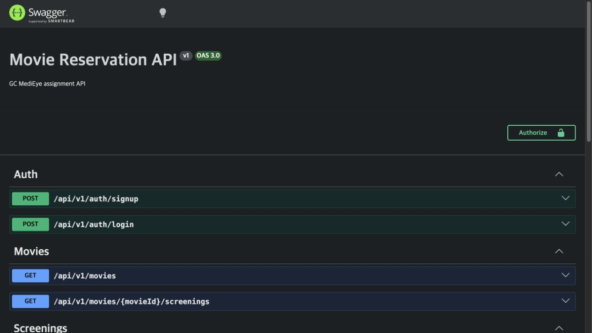
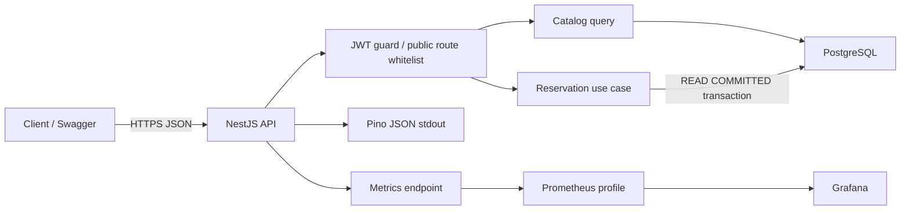
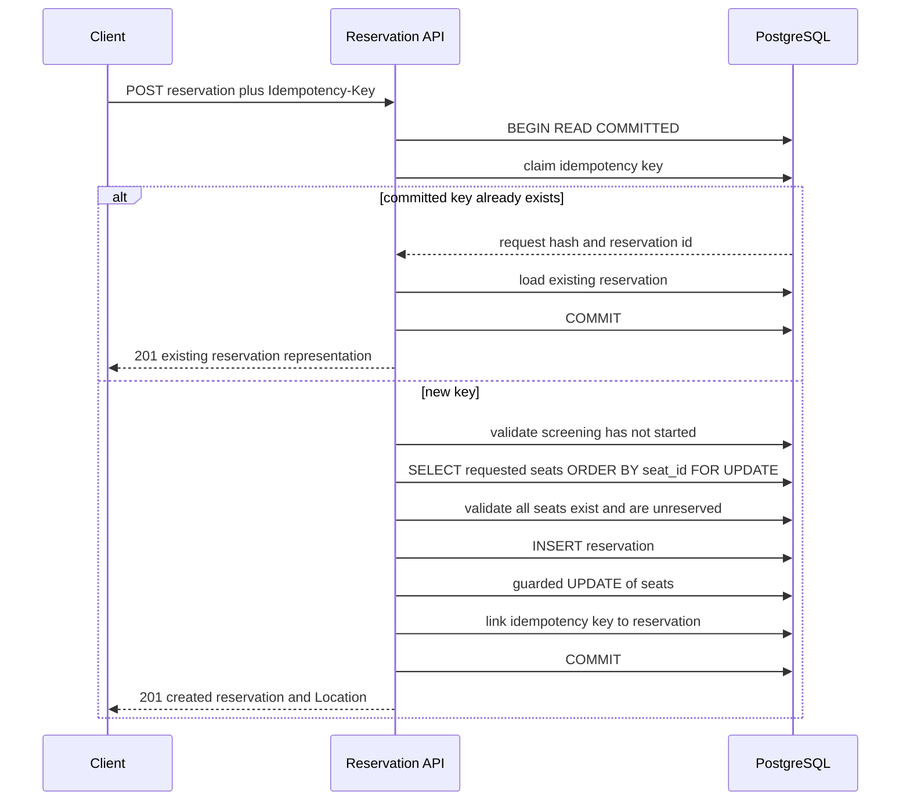
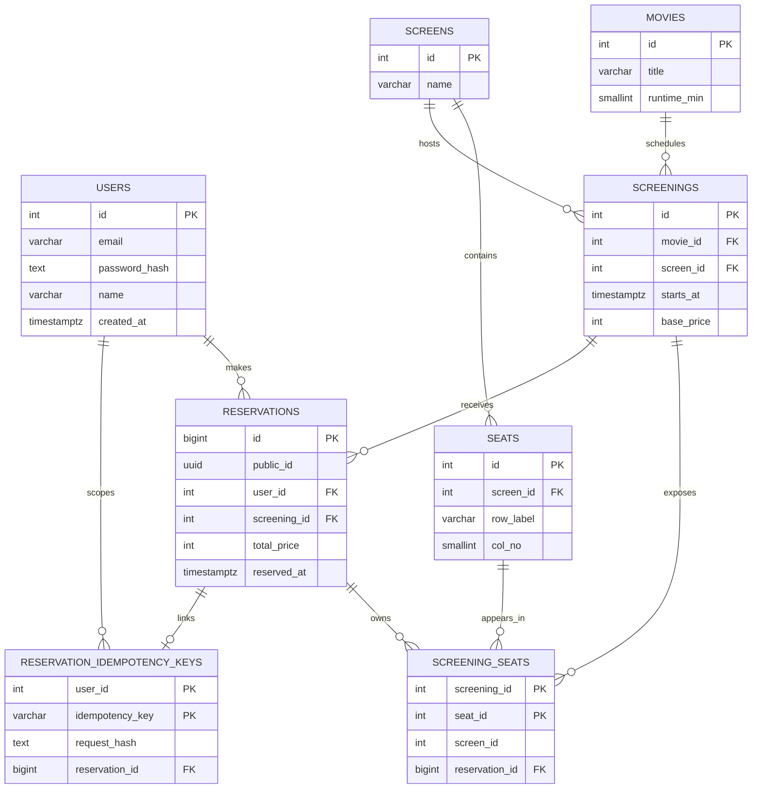
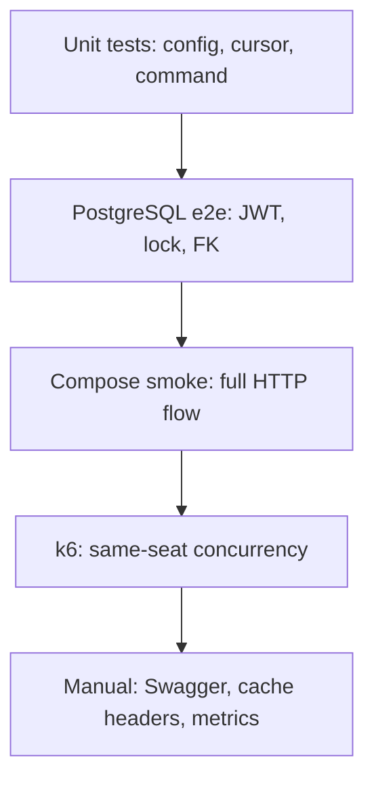
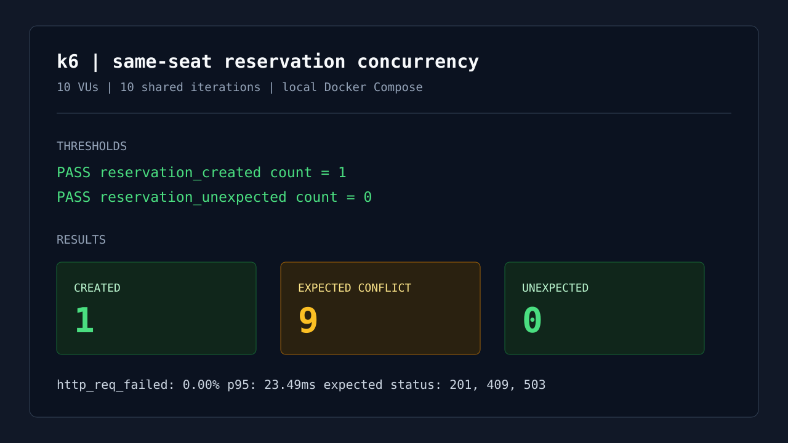

# Movie Reservation API

영화 목록, 상영 시간, 좌석 조회, 예매와 예매 내역 조회를 제공하는 Node.js + PostgreSQL API입니다.

이 시스템에서 가장 중요한 질문은 두 가지입니다. 같은 좌석 요청이 동시에 들어올 때 DB가 소유자를 정확히 한 번만 확정하는가, 그리고 commit 뒤 응답이 유실됐을 때 사용자가 같은 예매 결과를 다시 확인할 수 있는가입니다. 구현은 이 두 질문을 PostgreSQL transaction과 실제 실행 검증으로 답하는 데 집중했습니다.

## 한눈에 보는 핵심

| 확인할 문제             | 선택                                                                        | 근거와 확인 방법                                                                                                     |
| ----------------------- | --------------------------------------------------------------------------- | -------------------------------------------------------------------------------------------------------------------- |
| 같은 좌석의 동시 예매   | 요청 좌석을 seat_id 순으로 잠근 뒤 하나의 transaction에서 확정              | PostgreSQL e2e와 k6 10 VU 경쟁에서 201 한 건, 정상 경쟁 결과 409 아홉 건, 예상 밖 결과 0건을 확인했습니다.           |
| commit 뒤 응답 유실     | Idempotency-Key와 request hash를 reservation 생성과 같은 transaction에 기록 | 같은 key와 body는 같은 reservation을 반환하고, 다른 body는 422로 거절하는 e2e와 smoke 흐름을 실행했습니다.           |
| 예매 실패의 사용자 경험 | 짧은 lock timeout, 503과 Retry-After, 같은 key 재시도                       | lock wait을 UI 대기 시간으로 약속하지 않고 DB 자원 점유 상한으로 둡니다. 409와 일시 실패를 다른 흐름으로 안내합니다. |
| 제출 이후의 검토 가능성 | API 계약, 로그, metrics, 테스트, 지침을 코드와 함께 관리                    | Swagger, compose smoke, Prometheus scrape, lint의 dependency rule, guidance drift 검사를 실제로 실행했습니다.        |

## 목차

1. [구현 범위와 실행](#구현-범위)
2. [구조와 데이터 흐름](#구조와-데이터-흐름)
3. [API 계약과 인증 경계](#api-계약과-응답-기준)
4. [데이터 모델과 좌석 정합성](#데이터-모델)
5. [장애와 사용자 경험](#사용자-경험과-장애-처리)
6. [기술 선택과 운영 기준](#선택한-이유)
7. [검증과 부하 테스트](#테스트와-부하-검증)
8. [AI 작업 기준](#ai-작업-기준)

## 구현 범위

요구된 기능은 모두 HTTP API와 PostgreSQL 데이터로 구현했습니다. 데이터는 seed로 넣은 예시 영화와 상영 정보를 사용합니다.

| 범위      | 구현                                                               | 확인 경로                                                    |
| --------- | ------------------------------------------------------------------ | ------------------------------------------------------------ |
| 회원가입  | email 중복을 DB unique index로 막고 Argon2id hash를 저장           | POST /api/v1/auth/signup                                     |
| 로그인    | password 검증 후 issuer/audience가 있는 짧은 JWT access token 발급 | POST /api/v1/auth/login                                      |
| 영화 목록 | 영화 목록 조회, HTTP cache header 제공                             | GET /api/v1/movies                                           |
| 상영 시간 | 영화별 상영 조회, 이미 시작된 상영은 예매 시 다시 차단             | GET /api/v1/movies/:movieId/screenings                       |
| 좌석 조회 | 상영별 전체 좌석과 commit된 예매 상태 조회                         | GET /api/v1/screenings/:screeningId/seats                    |
| 좌석 예매 | 정렬 row lock, 조건부 update, 멱등 재시도, FK 제약                 | POST /api/v1/screenings/:screeningId/reservations            |
| 예매 내역 | 사용자 본인의 예약 목록 cursor pagination 및 상세 조회             | GET /api/v1/reservations, GET /api/v1/reservations/:publicId |

결제, 좌석 임시 점유, 취소, 관리자 CRUD는 넣지 않았습니다. 현재 흐름은 결제 없이 즉시 확정되는 예매입니다. 이 기능들을 일부만 추가하면 만료, 좌석 복구, 결제 실패 보상, 환불, 권한 모델처럼 더 큰 상태 전이와 장애 처리가 열리므로 현재 범위에는 맞지 않는다고 판단했습니다.

## 실행과 화면

### Docker Compose

```bash
docker compose up --build
```

PostgreSQL 18.6, migration/seed, NestJS API가 순서대로 실행됩니다. Compose는 로컬 개발 경로이므로 앱의 NODE_ENV도 development입니다. 호스트 PostgreSQL과 충돌하지 않도록 DB는 기본적으로 localhost:15432에 노출합니다.

```bash
POSTGRES_HOST_PORT=25432 docker compose up --build
```

API base URL은 http://localhost:3000/api/v1이고, Swagger UI는 http://localhost:3000/api-docs입니다. 상태 확인 endpoint는 /healthz, /readyz입니다.



Prometheus와 Grafana는 API 자체를 확인하는 기본 실행에 넣지 않고 선택 profile로 분리했습니다.

```bash
docker compose --profile monitoring up --build
```

Prometheus는 http://localhost:9090, Grafana는 http://localhost:3001에서 확인할 수 있습니다. Grafana의 admin / admin 계정은 로컬 확인용입니다. 운영 환경에서는 별도 secret을 주입하고, /metrics는 public internet이 아닌 내부 network 또는 gateway 보호 범위에 둡니다. 모니터링 화면은 반복적인 운영 확인용이라 README에는 넣지 않고, 동시성 결과 화면만 검증 근거로 남겼습니다.

volume까지 초기화해야 할 때만 다음 명령을 사용합니다.

```bash
docker compose down -v
```

### 로컬 실행

```bash
pnpm install
cp .env.example .env
pnpm db:migrate:seed
pnpm start:dev
```

Node.js 24 LTS와 PostgreSQL 18 이상을 기준으로 작성했습니다. 개발 환경에서도 .env의 JWT_SECRET은 충분히 긴 임의 값으로 바꿉니다. NODE_ENV=production에서는 JWT_SECRET과 DATABASE_URL이 누락되거나 로컬 기본값이면 앱이 시작하지 않습니다.

## 구조와 데이터 흐름

### 전체 구성



하나의 프로세스와 하나의 PostgreSQL에서 시작하는 modular monolith입니다. 배포 단위를 처음부터 나누면 네트워크 실패와 데이터 일관성 경계가 늘어납니다. 현재 규모에서 더 중요한 것은 예매 write path를 짧고 읽기 쉽게 유지하는 일이므로 모듈 경계만 분명히 했습니다.

### 이 구조에서 확인하려는 것

| 질문                                      | 코드에서의 답                                                                                            | 검증 위치                                      |
| ----------------------------------------- | -------------------------------------------------------------------------------------------------------- | ---------------------------------------------- |
| framework가 좌석 정합성을 대신 보장하는가 | 아닙니다. NestJS는 HTTP 경계와 validation을 맡고, 소유권 판정은 PostgreSQL transaction이 맡습니다.       | reservation use case와 PostgreSQL e2e          |
| lock SQL을 ORM 뒤에 숨겨도 되는가         | 이 흐름에서는 lock 순서와 guarded update가 핵심이므로 직접 SQL로 드러냈습니다.                           | repository의 SELECT FOR UPDATE, guarded UPDATE |
| 처음부터 서비스 분리가 필요한가           | 아닙니다. 지금은 한 DB transaction이 가장 중요한 경계이므로 모듈만 나누고 배포 단위는 하나로 유지합니다. | compose, module import lint                    |

| 영역                | 코드 구조                                                         | 선택한 이유                                                                                               |
| ------------------- | ----------------------------------------------------------------- | --------------------------------------------------------------------------------------------------------- |
| modules/reservation | Presentation / Application / Domain / Ports / PostgreSQL adapter  | row lock, idempotency, DB 제약처럼 규칙이 많은 흐름을 framework와 SQL 구현으로부터 분리하기 위해서입니다. |
| modules/auth        | Application / Domain / Ports / Infrastructure                     | password hash와 JWT 발급 알고리즘을 서비스 규칙과 분리했습니다.                                           |
| modules/catalog     | Controller -> QueryService -> SQL                                 | 읽기 전용 조회에 포트를 과하게 만들면 mapping과 interface만 늘어나므로 얇게 유지했습니다.                 |
| common              | config, error filter, response envelope, request context, logging | API 전반에서 반복되는 응답, 인증, trace, 설정 규칙을 한 곳에 모았습니다.                                  |
| infrastructure/db   | pool, transaction manager                                         | application이 PostgreSQL client를 직접 알지 않게 하되 transaction 경계는 코드에서 분명히 보이게 했습니다. |

ESLint import 규칙으로 reservation application/domain/ports와 auth application/domain/ports가 PostgreSQL 구현을 직접 import하지 않게 했습니다. 반대로 좌석 lock SQL 자체는 ORM 뒤에 숨기지 않았습니다. 이 시스템에서 검토해야 할 핵심이 SELECT FOR UPDATE, guarded UPDATE, 복합 FK이기 때문입니다.

### 예매 write flow



이 순서는 예매 중간에 서버가 꺼지는 경우도 고려합니다. commit 전이라면 PostgreSQL이 transaction 전체를 rollback하고 row lock을 해제합니다. commit 뒤 응답을 보내기 전에 연결이 끊기면 사용자는 결과를 모를 수 있으므로 같은 Idempotency-Key와 body로 다시 요청합니다.

## API 계약과 응답 기준

### Endpoint

| Method | Path                                         | 인증                  | 성공 status | 응답을 보내는 이유                                                                              |
| ------ | -------------------------------------------- | --------------------- | ----------- | ----------------------------------------------------------------------------------------------- |
| POST   | /api/v1/auth/signup                          | Public                | 201 Created | 사용자와 바로 사용할 access token을 반환해야 합니다.                                            |
| POST   | /api/v1/auth/login                           | Public                | 200 OK      | stateless JWT를 발급하지만 서버에 session resource를 만들지 않으므로 201보다 200이 맞습니다.    |
| GET    | /api/v1/movies                               | Public                | 200 OK      | 영화 목록을 반환합니다.                                                                         |
| GET    | /api/v1/movies/:movieId/screenings           | Public                | 200 OK      | 선택한 영화의 상영을 반환합니다.                                                                |
| GET    | /api/v1/screenings/:screeningId/seats        | Public                | 200 OK      | 좌석 선택 후보를 반환합니다.                                                                    |
| POST   | /api/v1/screenings/:screeningId/reservations | JWT + idempotency key | 201 Created | 확정된 reservation id, 좌석 목록, 예매 시각이 다음 화면에 필요합니다. Location도 함께 보냅니다. |
| GET    | /api/v1/reservations                         | JWT                   | 200 OK      | 본인 예매 목록과 다음 cursor를 반환합니다.                                                      |
| GET    | /api/v1/reservations/:publicId               | JWT                   | 200 OK      | 본인 예매 상세를 반환합니다.                                                                    |

모든 현재 성공 endpoint는 클라이언트가 다음 화면을 구성하는 데 필요한 representation이 있으므로 body를 반환합니다. 그래서 204 No Content endpoint는 현재 없습니다. 나중에 취소 API를 추가하더라도 단순한 성공 신호만 필요하면 204가 맞지만, 좌석 해제 시각이나 환불 상태를 보여줘야 한다면 200과 body를 반환하는 편이 낫습니다. status code는 CRUD 이름이 아니라 그 요청 뒤 클라이언트가 알아야 할 상태를 기준으로 정했습니다.

성공 응답은 global interceptor가 감싸고, 실패 응답은 global exception filter가 같은 형식으로 만듭니다. controller마다 response wrapper를 직접 만들지 않아 빠뜨릴 가능성을 줄였고, Swagger schema와 실제 envelope도 함께 관리합니다.

```json
{
  "success": true,
  "data": {
    "reservationId": "01a0503f-...",
    "screeningId": 1,
    "seatIds": [1, 2],
    "reservedAt": "2026-08-30T01:18:00.000Z"
  }
}
```

```json
{
  "success": false,
  "error": {
    "type": "https://api.reservation-system.local/problems/seat-already-reserved",
    "title": "Seat already reserved",
    "status": 409,
    "code": "SEAT_ALREADY_RESERVED",
    "detail": "One or more requested seats are already reserved."
  },
  "traceId": "92f9a6d2-..."
}
```

### 인증 경계

인증은 전역 JWT guard가 기본값입니다. 새 protected endpoint를 추가했을 때 guard를 붙이는 일을 잊지 않기 위한 선택입니다. 아래처럼 의도적으로 공개할 endpoint에만 PublicRoute decorator를 붙입니다.

| 공개 endpoint         | 이유                                                                     |
| --------------------- | ------------------------------------------------------------------------ |
| signup, login         | token을 얻기 전의 진입점입니다.                                          |
| 영화, 상영, 좌석 조회 | 로그인 전에도 예매 후보를 볼 수 있는 공개 catalog입니다.                 |
| healthz, readyz       | container health check가 token 없이 상태를 확인해야 합니다.              |
| metrics               | 로컬 Prometheus scrape 경로입니다. 운영에서는 network 경계로 제한합니다. |

인증이 없거나 JWT 검증이 실패하면 401 UNAUTHENTICATED입니다. 다른 사용자의 예매 상세는 리소스 존재를 알려 주지 않기 위해 404로 처리합니다. 현재 역할 기반 권한이 없어서 403이 실제로 발생하는 business endpoint는 없지만, global exception filter는 future authorization policy의 403 FORBIDDEN도 같은 오류 형식으로 반환합니다.

### Cache policy

| 경로      | header                                         | 이유                                                                                                           |
| --------- | ---------------------------------------------- | -------------------------------------------------------------------------------------------------------------- |
| 영화 목록 | public, max-age=300, stale-while-revalidate=60 | 목록이 최대 5분 늦어져도 좌석 소유권에 영향이 없습니다. browser나 CDN이 같은 목록 응답을 재사용할 수 있습니다. |
| 상영 목록 | no-store                                       | 시작 시각은 예매 가능 여부에 직접 영향을 줍니다.                                                               |
| 좌석 지도 | no-store                                       | 오래된 빈 좌석 화면보다 최신 응답이 우선입니다.                                                                |
| 예매 POST | cache 사용 안 함                               | 최종 판정은 항상 PostgreSQL transaction 안에서 합니다.                                                         |

이 cache는 HTTP response policy일 뿐, API process memory나 Redis에 상태를 저장하지 않습니다. 따라서 앱 재시작, 다중 인스턴스, cache invalidation을 새 장애 원인으로 만들지 않습니다.

## 데이터 모델



screening_seats는 상영의 특정 좌석을 표현합니다. 같은 물리 좌석도 상영마다 별도 row를 가지므로, 한 회차의 A1 예약이 다른 회차 A1을 막지 않습니다. 예매 가능 여부는 reservation_id IS NULL 하나입니다. 별도 AVAILABLE/RESERVED 문자열 상태를 두지 않아 상태 값과 FK 참조가 서로 어긋나는 문제를 피했습니다.

| 불변식                                        | DB에서 막는 방식               | 필요한 이유                                             |
| --------------------------------------------- | ------------------------------ | ------------------------------------------------------- |
| 로그인 email은 대소문자와 무관하게 유일       | uq_users_email_lower           | 가입 중복 검사와 login 조건이 같은 규칙을 사용합니다.   |
| 좌석은 자신이 속한 상영관의 상영에만 연결     | screening/seat 복합 FK         | 다른 상영관 좌석을 요청에 섞는 데이터를 막습니다.       |
| 좌석 예약과 reservation의 상영이 같다         | reservation/screening 복합 FK  | 잘못된 SQL이 다른 상영의 예약을 연결하는 일을 막습니다. |
| idempotency key와 reservation의 사용자가 같다 | reservation/user 복합 FK       | 다른 사용자의 예약 결과를 key로 참조하지 못하게 합니다. |
| 한 screening-seat의 소유자는 한 명뿐          | screening_seats.reservation_id | 중복 예매를 표현할 두 번째 상태 자체가 없습니다.        |
| 여러 좌석은 전부 확정되거나 전부 rollback     | 하나의 transaction             | 부분 성공 예매를 남기지 않습니다.                       |

## 좌석 예매 정합성

### row lock을 잡는 순서

예매 요청은 READ COMMITTED transaction 하나 안에서 처리됩니다.

1. request body의 seatIds를 중복 없이 정렬하고, 이 정렬된 값을 idempotency request hash와 lock 순서에 함께 사용합니다.
2. user_id와 idempotency_key로 key를 먼저 claim합니다.
3. 이미 commit된 key라면 body hash를 비교합니다. 같으면 기존 reservation을 반환하고, 다르면 422 IDEMPOTENCY_KEY_REUSED를 반환합니다.
4. 새 key라면 상영이 존재하고 아직 시작하지 않았는지 확인합니다.
5. 요청된 screening_seats를 seat_id ASC 순서로 SELECT FOR UPDATE 합니다.
6. 요청한 모든 좌석이 해당 상영에 있는지, 이미 예매됐는지 잠근 뒤 판단합니다.
7. reservation을 insert하고, reservation_id IS NULL 조건을 둔 guarded update로 좌석을 배정합니다.
8. key와 reservation을 link한 뒤 commit합니다.

여러 사용자가 A1, A2를 반대 순서로 요청해도 같은 순서로 lock을 잡으므로 교착 가능성을 낮춥니다. database는 여전히 deadlock 또는 serialization failure를 낼 수 있으므로 해당 오류만 최대 두 번 transaction 전체를 재시도합니다.

lock query에 reservation_id IS NULL을 넣지 않은 점도 의도적입니다. 처음부터 빈 좌석만 조회하면 이미 예매된 row를 건너뛰고 좌석이 없는 것과 다른 사용자가 예약한 것을 구분하기 어렵습니다. 요청한 row를 먼저 모두 잠근 다음, 없는 좌석은 SEAT_NOT_IN_SCREENING, 이미 예매된 좌석은 SEAT_ALREADY_RESERVED로 나눕니다.

마지막 guarded update는 lock 뒤에도 한 번 더 둔 방어선입니다. affected row 수가 요청 좌석 수와 다르면 정상 충돌로 조용히 처리하지 않고 invariant violation으로 transaction을 rollback합니다. 이 시점에는 lock을 잡았다는 전제가 깨졌다는 의미라서, 성공 응답을 보내는 편이 더 위험합니다.

### Idempotency-Key가 해결하는 문제

Idempotency-Key는 중복 예매 방지 장치가 아닙니다. 중복 예매는 row lock, guarded update, FK가 막습니다. key는 commit 뒤 응답 유실처럼 사용자가 결과를 관찰하지 못한 상황에서 같은 의도의 결과를 다시 찾기 위한 장치입니다.

| 상황                        | DB 상태                          | API 처리                                           |
| --------------------------- | -------------------------------- | -------------------------------------------------- |
| 같은 key와 같은 body 재요청 | reservation이 이미 commit됨      | 같은 reservation representation을 다시 반환합니다. |
| 같은 key와 다른 body        | 첫 요청 의도와 충돌              | 422 IDEMPOTENCY_KEY_REUSED를 반환합니다.           |
| 새 key와 이미 예매된 좌석   | 다른 구매 의도지만 좌석은 소진됨 | 409 SEAT_ALREADY_RESERVED를 반환합니다.            |
| transaction 중 서버 종료    | 미커밋 변경이 rollback됨         | key와 reservation, 좌석 배정이 함께 사라집니다.    |
| commit 뒤 응답 유실         | reservation이 commit됨           | 같은 key/body 재요청으로 결과를 확인합니다.        |

key claim, reservation insert, seat assignment, key link를 반드시 같은 transaction에 둔 이유가 여기에 있습니다. key만 남고 예약이 없거나, 예약은 남았지만 재시도에 연결할 key가 없는 상태를 만들지 않습니다.

## 사용자 경험과 장애 처리

### 좌석 조회와 예매 중 상태

이 API는 결제 없는 즉시 확정 모델이므로 좌석 지도에 commit되지 않은 RESERVING 상태를 보여주지 않습니다. 다른 transaction이 FOR UPDATE로 A1 row를 잠깐 잠그고 있어도 일반 조회는 마지막 commit 상태를 읽습니다. 화면에는 A1이 아직 선택 후보로 보일 수 있지만, 실제 소유권은 POST /reservations transaction에서만 결정됩니다.

클라이언트는 사용자가 예매 버튼을 누른 동안 자신이 고른 좌석만 local submitting 상태로 비활성화하면 됩니다. 서버가 성공하면 seat map을 다시 읽어 확정 상태를 보이고, 409면 다른 사용자가 먼저 예매한 좌석을 안내한 뒤 최신 seat map을 보여 줍니다. 서버가 보장하지 않은 임시 점유 시간을 화면에 약속하지 않기 위한 선택입니다.

결제 화면이 생기면 판단이 달라집니다. 그때는 AVAILABLE -> HELD -> BOOKED와 held_until, hold owner, 만료 worker, 결제 실패 보상, cache 갱신을 함께 설계해야 합니다. Redis SET NX EX는 빠른 hold에 도움이 될 수 있지만, Redis 재시작과 hold 만료 뒤에도 PostgreSQL의 최종 확정 규칙이 유지되어야 합니다. 결제가 없는 현재 범위에서 hold만 먼저 넣으면 사용자 경험보다 만료와 복구 문제를 더 크게 만들므로 제외했습니다.

### 대기와 재시도

PG_SEAT_LOCK_TIMEOUT_MS=500은 사용자에게 보여 주는 대기실 시간이 아니라 DB connection을 오래 점유하지 않기 위한 상한입니다. 먼저 들어온 transaction이 빨리 commit되면 뒤 요청은 짧게 기다린 뒤 201 또는 409를 받습니다. lock wait이 500ms를 넘으면 503 RESERVATION_TEMPORARILY_UNAVAILABLE과 Retry-After: 1을 반환합니다.

| 결과                                    | 클라이언트가 할 일                                               | 자동 재시도              |
| --------------------------------------- | ---------------------------------------------------------------- | ------------------------ |
| 201 Created                             | 확정된 예약을 보여 주고 seat map을 갱신합니다.                   | 하지 않음                |
| 409 SEAT_ALREADY_RESERVED               | 최신 seat map을 읽고 다른 좌석을 선택하게 합니다.                | 하지 않음                |
| 422 IDEMPOTENCY_KEY_REUSED              | 같은 key에 다른 의도가 섞였으므로 사용자 선택을 다시 확인합니다. | 하지 않음                |
| 503 RESERVATION_TEMPORARILY_UNAVAILABLE | Retry-After를 따릅니다.                                          | 같은 key/body로 최대 2회 |
| network timeout, connection reset       | commit 여부를 알 수 없습니다.                                    | 같은 key/body로 최대 2회 |

재시도를 최대 두 번으로 제한한 이유는 실패한 사용자가 무한히 다시 요청해 lock 경합과 connection pool 대기를 키우는 상황을 피하기 위해서입니다. 1초 간격에 작은 jitter를 더하는 정책으로 시작하고, 실제 timeout 비율과 p95 지연 시간을 본 뒤 조정하는 편이 낫습니다.

고수요 오픈처럼 DB 수용량보다 더 많은 요청이 들어오는 경우에는 예매 transaction 안에 Kafka나 queue를 섞기보다, 앞단 waiting room, rate limit, traffic shaping으로 유입률을 조절해야 합니다. queue를 넣어도 특정 좌석의 최종 확정은 결국 DB에서 다시 판정해야 하기 때문입니다. 현재 구현은 이 운영 계층까지 만들지 않고, DB timeout과 monitoring signal로 병목을 먼저 드러내는 범위로 제한했습니다.

## 선택한 이유

### PostgreSQL과 version

PostgreSQL을 고른 핵심 이유는 version 18의 UUID 함수가 아니라, 이 문제에 필요한 row-level lock, transaction, conditional write, FK 제약을 한 데이터베이스에서 함께 쓸 수 있기 때문입니다. 같은 좌석을 한 번만 확정하는 규칙은 별도 distributed lock보다 PostgreSQL transaction으로 더 짧고 검증 가능하게 표현됩니다.

Compose image는 postgres:18.6-bookworm으로 고정했습니다. 이 선택에는 세 가지 이유가 있습니다.

1. 로컬 실행, e2e Testcontainers, migration이 같은 PostgreSQL 동작을 보게 하려는 재현성입니다.
2. PostgreSQL 18의 built-in uuidv7()을 public id 기본값으로 써 extension 없이 시간 순서에 가까운 UUID를 만들 수 있습니다.
3. seed, migration, Docker image가 함께 고정되므로 내 환경에서만 되는 최신 version이 아니라 실행 가능한 기준점을 제공합니다.

다만 UUIDv7만으로 PostgreSQL 18을 선택했다고 보지는 않습니다. 좌석 lock, FK, guarded update 설계 자체는 더 이른 PostgreSQL 지원 version에서도 성립합니다. 현재 migration에서 18이 필요한 부분은 DB-side uuidv7() default뿐입니다. 실제 조직에서는 managed database의 지원 정책, extension 운영, 업그레이드 경로를 먼저 확인하고 version을 고르며, 18을 사용할 수 없다면 public id를 application에서 생성해 migration 의존성을 낮추는 선택도 가능합니다.

### 선택지 비교

| 결정 지점     | 고려한 선택지                                             | 현재 선택                   | 이유와 감수한 비용                                                                                                                                               |
| ------------- | --------------------------------------------------------- | --------------------------- | ---------------------------------------------------------------------------------------------------------------------------------------------------------------- |
| API framework | Express 직접 조립, NestJS + ORM, NestJS + SQL             | NestJS + 직접 SQL           | guard, validation, interceptor/filter, module 경계는 NestJS 도움을 받고 핵심 SQL은 그대로 읽게 했습니다. 작은 API에는 framework 의식이 늘어나는 비용이 있습니다. |
| 좌석 소유권   | PostgreSQL transaction, Redis lock, Kafka/queue           | PostgreSQL transaction      | 최종 소유자는 DB가 정해야 합니다. Redis/Kafka를 넣으면 lock 유실, event 재처리, 운영 복구 지점이 늘고도 마지막 DB 판정은 남습니다.                               |
| SQL 표현      | ORM, 직접 pg SQL                                          | 직접 pg SQL                 | lock 순서와 conditional update, 복합 FK를 리뷰에서 바로 볼 수 있습니다. ORM의 CRUD 생산성은 일부 포기했습니다.                                                   |
| 공개 식별자   | bigint만 노출, DB UUIDv7, app UUIDv7                      | internal bigint + DB UUIDv7 | join과 FK에는 작은 internal key, 외부 URL에는 추측하기 어려운 public id를 사용합니다. PostgreSQL 18 version 결합이 생기는 비용은 위에 명시했습니다.              |
| 인증          | 서버 session, access + refresh token, access token만      | 짧은 JWT access token       | 요구 범위에서 token 저장, 폐기, 탈취 대응까지 열리는 refresh token은 제외했습니다. login은 200으로 token representation을 반환합니다.                            |
| 좌석 hold     | 즉시 확정, TTL hold                                       | 즉시 확정                   | 결제가 없으므로 만료 worker와 복구보다 짧은 확정 transaction이 더 예측 가능합니다.                                                                               |
| 조회 cache    | Redis/process cache, HTTP cache만, 모든 endpoint no-store | 영화 목록만 HTTP cache      | 영화 목록은 약간 늦어도 안전하지만 좌석 map은 최신성이 중요합니다. 별도 cache state와 invalidation 비용을 피했습니다.                                            |
| 로그          | Nest 기본 logger, Winston, Pino                           | Pino JSON stdout            | container 수집과 request correlation을 적은 설정으로 맞춥니다. pretty console은 별도 도구가 필요합니다.                                                          |
| 모니터링      | 기본 compose 포함, profile 분리                           | Prometheus/Grafana profile  | 빠른 API 실행을 유지하면서 운영 신호가 필요할 때만 stack을 올립니다.                                                                                             |
| 테스트        | mock 중심, 실제 PostgreSQL e2e                            | 둘 다 사용                  | 빠른 unit test와 실제 lock/FK e2e를 나눴습니다. Docker가 필요한 e2e는 실행 시간이 더 듭니다.                                                                     |

Redis는 조회수처럼 조금 뒤 DB에 합산해도 되는 counter에는 효과적입니다. 반면 이 예매는 특정 좌석의 현재 소유자를 한 번만 정해야 합니다. 그래서 Redis 값을 DB 값에 합쳐 보여 주는 유형의 설계를 여기에는 적용하지 않았습니다. 데이터 성격에 따라 도구를 고르는 쪽이 Redis나 Kafka를 무조건 넣는 것보다 낫다고 봤습니다.

모든 table에 deleted_at, updated_at도 관성적으로 넣지 않았습니다. 현재는 탈퇴, 상영 관리, 취소가 없고 updated_at은 PostgreSQL default만으로 유지되지 않아 모든 update에 규율을 추가해야 합니다. 취소 기능이 생기면 soft delete 하나로 끝내지 않고 cancelled_at, 좌석 해제, 환불 상태를 하나의 transaction으로 설계해야 합니다.

## 설정 cache index

환경별 값은 .env.example로 모았습니다. 지금의 숫자는 단일 로컬 Compose와 동시성 검증에서 DB connection을 과도하게 늘리거나 요청을 오래 붙잡지 않기 위한 시작값입니다. 운영의 확정값이 아니며, 실제 pool wait, p95, DB CPU, lock timeout 비율을 본 뒤 조정해야 합니다.

| 설정                           | 기본값 | 의미                                                                 |
| ------------------------------ | -----: | -------------------------------------------------------------------- |
| PG_POOL_MAX                    |     10 | 로컬 DB에 과도한 session을 만들지 않는 pool 상한입니다.              |
| PG_CONNECTION_TIMEOUT_MS       |   1000 | pool에서 connection을 얻지 못했을 때의 상한입니다.                   |
| PG_IDEMPOTENCY_LOCK_TIMEOUT_MS |    300 | 같은 key 요청끼리 불필요하게 오래 기다리지 않는 상한입니다.          |
| PG_SEAT_LOCK_TIMEOUT_MS        |    500 | 좌석 lock 경합이 pool을 오래 점유하지 않게 하는 상한입니다.          |
| PG_STATEMENT_TIMEOUT_MS        |   3000 | 개별 SQL의 실행 시간 상한입니다.                                     |
| PG_IDLE_IN_TX_TIMEOUT_MS       |   4000 | transaction을 열어 둔 유휴 session을 끊는 상한입니다.                |
| PG_TRANSACTION_TIMEOUT_MS      |   5000 | 예매 transaction 전체 시간 상한입니다.                               |
| RESERVATION_MAX_SEATS          |      8 | 한 요청이 잠그는 row 수를 제한합니다.                                |
| RESERVATION_TX_RETRY_ATTEMPTS  |      2 | deadlock 또는 serialization failure의 transaction 재시도 횟수입니다. |
| JWT_EXPIRES_IN_SECONDS         |   3600 | refresh token이 없는 범위에서 짧게 둔 access token 수명입니다.       |

idempotency lock timeout < seat lock timeout < statement timeout < transaction timeout 관계를 의도적으로 유지합니다. 먼저 동일 key 경합을 짧게 끊고, 그보다 조금 긴 좌석 경합을 처리한 뒤, SQL과 transaction 전체에는 마지막 상한을 둡니다. idle in transaction timeout은 transaction 전체 timeout보다 작아야 유휴 session을 먼저 정리할 수 있습니다. config loader는 이 관계가 깨지는 값을 시작 단계에서 거절합니다.

현재 query 모양에 맞춘 index는 다음과 같습니다.

| index 또는 key                             | 사용하는 흐름                      | 넣지 않은 대안과 이유                                          |
| ------------------------------------------ | ---------------------------------- | -------------------------------------------------------------- |
| uq_users_email_lower                       | 가입 중복 검사, login email lookup | 원본 email index만 두면 lower(email) 조건의 규칙과 어긋납니다. |
| idx_screenings_movie_time                  | 영화별 미래 상영 시간순 조회       | starts_at 단독 index는 movie 조건을 먼저 좁히지 못합니다.      |
| screening_seats PK (screening_id, seat_id) | 정렬 lock, guarded update          | 별도 seat lock index는 PK와 중복됩니다.                        |
| idx_ss_reservation partial index           | reservation detail의 좌석 join     | 예약된 row만 담아 완료 reservation 조회를 가볍게 합니다.       |
| idx_reservations_user_recent               | user별 최신순 cursor pagination    | user filter, 정렬, cursor 조건을 함께 처리합니다.              |
| idempotency PK (user_id, idempotency_key)  | key claim, replay, link            | key를 사용자 범위로 분리하고 DB가 중복을 막습니다.             |

좌석 map에는 reservation_id IS NULL partial index를 추가하지 않았습니다. 이 API는 빈 좌석만 찾는 것이 아니라 특정 상영의 모든 좌석을 정렬해 보여 줍니다. 예매가 확정될 때마다 partial index도 갱신되므로, 실제 실행 계획과 데이터 크기에서 필요성이 확인되기 전에는 PK로 유지하는 편이 낫습니다.

## 로그와 모니터링

### 요청 추적과 안전한 로그

X-Request-Id가 유효한 UUID로 들어오면 그대로 쓰고, 없거나 잘못된 형식이면 서버가 UUID를 만듭니다. response header의 X-Request-Id와 오류 envelope의 traceId는 같은 값입니다. 사용자가 오류 응답의 trace id를 전달하면 해당 요청의 로그를 좁힐 수 있습니다.

Pino는 JSON을 stdout에 남깁니다. password, JWT, Authorization, cookie, request body는 호출부에서 로그 field에 넣지 않고 redaction도 적용했습니다. health/readiness와 Prometheus scrape은 반복 호출이 많아 일반 요청 완료 로그에서 제외했습니다.

| 이벤트                        | 남기는 정보                                             | 보는 이유                                          |
| ----------------------------- | ------------------------------------------------------- | -------------------------------------------------- |
| http.request.completed        | traceId, route, method, status, duration, userId        | endpoint별 요청량, 오류율, 느린 요청을 확인합니다. |
| http.request.failed           | traceId, route, error code, retryable 여부              | 5xx와 retryable 503의 원인을 구분합니다.           |
| reservation.created           | userId, screeningId, seatCount, reservationId, duration | 실제 확정 예매를 추적합니다.                       |
| reservation.replayed          | 같은 field                                              | 신규 예매와 응답 유실 뒤 재요청을 구분합니다.      |
| reservation.transaction.retry | retry number, PostgreSQL code                           | deadlock/serialization retry가 늘어나는지 봅니다.  |
| postgres.pool.ready/error     | pool policy, error                                      | 연결 초기화와 pool 장애를 확인합니다.              |

이 로그는 audit log나 장기 보관 정책을 대신하지 않습니다. 현재 범위에서는 장애를 좁히고 요청을 연결하기 위한 운영 로그로 한정했습니다.

### Prometheus와 Grafana

| metric                        | 판단에 쓰는 신호                         |
| ----------------------------- | ---------------------------------------- |
| http_requests_total           | endpoint/status별 요청량과 409, 5xx 비율 |
| http_request_duration_seconds | p95 지연과 lock 대기 증가                |
| pg_pool_total_connections     | pool 사용량                              |
| pg_pool_idle_connections      | 즉시 사용할 수 있는 connection           |
| pg_pool_waiting_clients       | pool 포화로 대기하는 요청                |
| reservation_nodejs_*          | heap, event loop, process 상태           |

HTTP label은 숫자 id와 UUID를 그대로 쓰지 않고 /:id, /:uuid로 정규화합니다. label cardinality가 끝없이 늘어나면 monitoring system 자체가 부담이 되기 때문입니다. 예매 실패율과 p95가 함께 오르면 좌석 lock 경합을 먼저 보고, pg_pool_waiting_clients도 함께 오르면 pool 상한이나 앞단 traffic shaping을 검토합니다.

## 테스트와 부하 검증

### 검증 계층



```bash
pnpm guidance:check
pnpm build
pnpm lint
pnpm test
RUN_E2E=1 pnpm test:e2e
docker compose up --build
pnpm smoke:api
k6 run load-test/reservation-concurrency.js
```

최종 확인에서 다음 결과를 얻었습니다.

| 검증               | 결과      | 확인한 내용                                                                                                                                        |
| ------------------ | --------- | -------------------------------------------------------------------------------------------------------------------------------------------------- |
| build              | 통과      | TypeScript build가 완료됩니다.                                                                                                                     |
| lint               | 통과      | ESLint dependency direction과 코드 규칙을 통과합니다.                                                                                              |
| unit test          | 14개 통과 | config 범위, production secret/DB 거절, cursor, command 정규화를 확인합니다.                                                                       |
| PostgreSQL e2e     | 8개 통과  | 회원, JWT, API envelope, 좌석 lock, idempotency, FK, ownership, pagination을 실제 DB에서 확인합니다.                                               |
| Compose smoke      | 통과      | health/ready, signup 201, login 200, movies 3개, screenings 2개, seats 24개, reservation/replay 201, conflict 409, list/detail 200을 확인했습니다. |
| k6 concurrent seat | 통과      | 같은 좌석 10개 동시 요청에서 생성 1건, 예상 실패 9건, 예상 밖 결과 0건을 확인했습니다.                                                             |
| HTTP cache         | 통과      | movie는 max-age=300, stale-while-revalidate=60, screening/seat는 no-store를 확인했습니다.                                                          |
| Prometheus         | 통과      | reservation-api target이 up이고 app metrics를 scrape하는 것을 확인했습니다.                                                                        |

### k6 시나리오가 말해 주는 것과 말해 주지 않는 것

load-test/reservation-concurrency.js는 10 VU가 같은 screeningId와 seatId로 예매를 요청하는 테스트입니다. 기대값은 201 한 건, 409 아홉 건입니다. 이 테스트는 동시에 같은 좌석이 들어왔을 때 한 건만 확정되는가를 확인하기 위한 correctness test입니다.



k6에서는 201, 409, 503을 이 scenario의 expected HTTP status로 표시했습니다. 409는 테스트 실패가 아니라 다른 요청이 먼저 좌석을 확정했다는 정상 경쟁 결과이므로, 기본 http_req_failed 지표에 장애처럼 섞이지 않게 하기 위해서입니다. 별도 custom counter로 생성 건수, 예상 충돌 또는 일시 실패, 예상 밖 결과를 나눠 threshold를 둡니다.

이 결과만으로 특정 RPS를 감당한다고 주장하지는 않습니다. 로컬 Docker, 단일 PostgreSQL, 10개 요청은 대규모 오픈런 capacity test가 아닙니다. 실제 수용량을 판단하려면 production과 비슷한 CPU, connection pool, DB IOPS, network, arrival rate를 둔 상태에서 p95/p99, 503 비율, pool waiting, lock timeout, DB CPU를 측정해야 합니다. 현재 k6 결과는 그 측정 전에 중복 예매 규칙이 깨지지 않는지 확인하는 최소 시나리오입니다.

### 제출 패키지

```bash
pnpm submission:zip
```

스크립트는 Git tracked/unignored 파일만 새 zip으로 만들고, 기존 archive를 먼저 지웁니다. 따라서 node_modules, dist, .DS_Store, __MACOSX, 삭제된 문서가 이전 zip에서 남아 다시 포함되는 일을 막습니다.

## AI 작업 기준

AI 도구를 코드 생성기로만 쓰지 않고, 선택지를 넓게 점검한 뒤 구현과 실행 검증으로 좁히는 방식으로 사용했습니다. 특히 좌석 예매에서는 그럴듯한 구조보다 DB가 실제로 어떤 순서로 lock과 rollback을 처리하는지가 중요하므로, 설명보다 PostgreSQL e2e와 k6 결과를 우선했습니다.

| 파일                                   | 역할                       | 왜 분리했는지                                                                                                   |
| -------------------------------------- | -------------------------- | --------------------------------------------------------------------------------------------------------------- |
| AGENTS.md                              | 저장소의 기준 정책         | 구현 범위, 불변식, API/인증, 문서, 검증, Git 경계를 한 곳에서 정의합니다.                                       |
| CLAUDE.md                              | Claude project entry point | Claude가 시작할 때 같은 기준을 읽게 하는 어댑터입니다. 독자적인 설계를 만들지 않고 AGENTS.md를 기준으로 둡니다. |
| .codex/skills/gc-medi-eye-reservation  | Codex 작업 체크리스트      | 구현이나 리뷰 중 바로 필요한 lock/idempotency/verification 항목을 짧게 불러옵니다.                              |
| .claude/skills/gc-medi-eye-reservation | Claude 작업 체크리스트     | 같은 비타협 규칙을 Claude 경로에서도 적용합니다.                                                                |
| .claude/commands/verify-reservation.md | 반복 검증 순서             | status, guidance, build, lint, unit, e2e, compose, smoke 순서를 빠뜨리지 않게 합니다.                           |

파일별 표현은 entry point에 맞게 다르지만, 다음 네 가지는 달라지면 안 됩니다.

1. screening_seats.reservation_id가 좌석 소유권의 단일 상태여야 합니다.
2. Idempotency-Key는 응답 유실 뒤 재시도를 위한 것이고, 중복 예매 방지는 PostgreSQL transaction이 담당해야 합니다.
3. 좌석은 seat_id 순서로 lock한 뒤에 가용성을 판단해야 합니다.
4. README의 기술 주장은 가능하면 실제 PostgreSQL e2e, Compose smoke, k6처럼 실행 가능한 확인으로 뒷받침해야 합니다.

pnpm guidance:check는 AGENTS.md, CLAUDE.md, 두 skill에 이 핵심 개념과 verification command가 모두 있는지, 제거한 별도 ADR workflow 문구가 다시 들어오지 않았는지를 확인합니다. 문서 일관성을 완전히 보장하는 도구는 아니지만, tool entry point가 시간이 지나며 서로 다른 규칙으로 drift하는 가장 단순한 실패를 막는 안전장치입니다.

AI가 제안한 설계나 문장은 바로 제출하지 않습니다. 변경한 불변식의 코드 경로를 읽고, 가장 가까운 unit/e2e를 실행하고, 마지막에 전체 build/lint/smoke로 다시 확인합니다. 이 흐름은 AI를 특별한 기능으로 보이게 하기보다, 반복되는 검토 기준을 파일과 명령으로 남겨 다음 작업에서도 같은 수준으로 검토하려는 방법입니다.

### Skill을 찾게 만드는 description

skill의 frontmatter는 장식용 설명이 아니라, 어떤 작업에서 이 체크리스트를 불러와야 하는지를 좁히는 metadata입니다. description을 단순히 Node.js 개발로 넓게 쓰면 무관한 작업에서도 긴 지침이 끼어들고, 너무 좁게 쓰면 reservation review에서 빠질 수 있습니다. 그래서 기술 이름과 판단 대상, 확인 범위를 함께 넣었습니다.

```yaml
name: gc-medi-eye-reservation
description: >
  Help implement, review, and verify this GC MediEye movie reservation
  assignment, especially PostgreSQL-backed seat reservation correctness
  and idempotent retry behavior.
```

이 문구가 대상으로 삼는 것은 일반적인 CRUD 생성이 아니라 architecture, seat reservation correctness, PostgreSQL behavior, README claims, end-to-end verification입니다. 그 결과 예매 흐름을 고칠 때는 lock 순서와 replay 규칙을, 문서를 고칠 때는 실행 가능한 근거를 먼저 확인하도록 유도합니다. 지침 파일이 많아지는 효과보다, 필요한 순간에 필요한 검토 기준이 적용되는 효과를 우선했습니다.

### 지침을 나눈 방식과 고도화 과정

처음부터 모든 도구 지침을 같은 긴 문서로 복제하면 시작은 빠르지만, 한쪽만 고쳐져 서로 다른 규칙을 따르는 문제가 생깁니다. 반대로 규칙을 너무 짧게 줄이면 예매 흐름의 핵심인 lock 순서, idempotency의 역할, transaction 경계를 놓치기 쉽습니다. 그래서 이 저장소에서는 기준 정책, 도구별 진입점, 작업 체크리스트, 자동 검사를 다음처럼 나눴습니다.

| 단계            | 선택                                                                                          | 이유                                                                  | 의도적으로 하지 않은 일                                                                                                                     |
| --------------- | --------------------------------------------------------------------------------------------- | --------------------------------------------------------------------- | ------------------------------------------------------------------------------------------------------------------------------------------- |
| 기준 정책       | AGENTS.md에 범위, 불변식, API/인증, 검증, Git 경계를 모음                                     | 설계가 바뀌었을 때 판단 기준을 한 곳에서 읽을 수 있어야 합니다.       | Codex와 Claude 파일에 전체 정책을 복사하지 않았습니다. 복제본이 늘수록 drift 비용이 커집니다.                                               |
| 도구별 진입점   | CLAUDE.md는 AGENTS.md를 먼저 읽게 하고 Claude 실행 맥락만 덧붙임                              | 도구마다 시작 방식은 다르지만 아키텍처 결론은 하나여야 합니다.        | Claude 전용의 다른 seat state나 transaction 규칙을 만들지 않았습니다.                                                                       |
| 작업 체크리스트 | 두 skill에는 예매 작업에서 바로 확인할 lock, guarded update, retry, 검증 항목을 둠            | 긴 정책을 매번 다시 해석하지 않고 변경 직전에 필요한 실수를 줄입니다. | 현재 규모에 비해 implement/migrate/check처럼 많은 skill로 나누지 않았습니다. 기능과 팀이 커져 체크리스트가 독립적으로 길어질 때 분리합니다. |
| 반복 검증       | Claude command에는 status부터 smoke까지의 순서를 두고, package script에는 guidance:check를 둠 | 사람이나 도구가 자주 빼먹는 확인 순서를 실행 경로로 남깁니다.         | 문서의 의미까지 완전하게 비교하는 복잡한 생성기나 LLM 검증기는 추가하지 않았습니다.                                                         |

고도화는 기능을 더 많이 넣는 방향보다, 잘못된 확신을 줄이는 방향으로 진행했습니다.

1. 문서가 길어질수록 설계 근거가 여러 파일에 흩어지면 평가자가 흐름을 따라가기 어려웠습니다. 별도 ADR tree 대신 구조, 선택지, 비용, 검증 결과를 이 README에 모았습니다.
2. Codex와 Claude 파일은 표현과 실행 맥락이 달라지면서도 핵심 규칙은 같아야 했습니다. 네 entry point에 필요한 개념을 검사하는 guidance:check를 넣어, lock/transaction/API boundary가 한쪽에서 빠지는 단순한 drift를 CI 이전에 발견하게 했습니다.
3. 문서의 문장만으로는 concurrency나 crash boundary가 증명되지 않습니다. PostgreSQL e2e, Compose smoke, k6 경쟁 시나리오를 먼저 실행하고 README에는 관찰한 결과와 검증 범위만 적었습니다.
4. API 계약과 관측 지표도 같은 원칙으로 정리했습니다. stateless login은 200, 새 reservation은 201로 구분했고, k6에서는 정상 경쟁의 409와 예상 밖 실패를 별도 지표로 나눴습니다. status code와 실패율 숫자가 실제 의미를 흐리지 않게 하기 위해서입니다.

더 강한 방법으로는 지침 원본 하나에서 Codex/Claude 파일을 자동 생성하거나, 문서 AST를 비교하는 검증기를 만들 수 있습니다. 다만 네 개의 짧은 Markdown 파일에 그 체계를 도입하면 생성 규칙 자체가 또 하나의 유지보수 대상이 됩니다. 현재는 사람이 읽기 좋은 기준 문서와 작은 문자열 검사로 시작하고, 실제로 drift가 반복되거나 스킬 수가 늘어날 때 생성 기반 관리로 확장하는 것이 비용 대비 적절하다고 판단했습니다.
